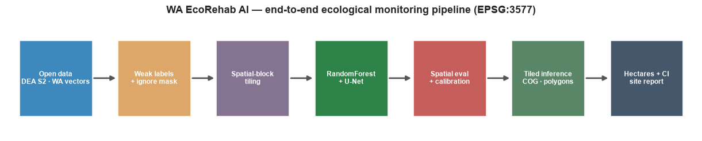
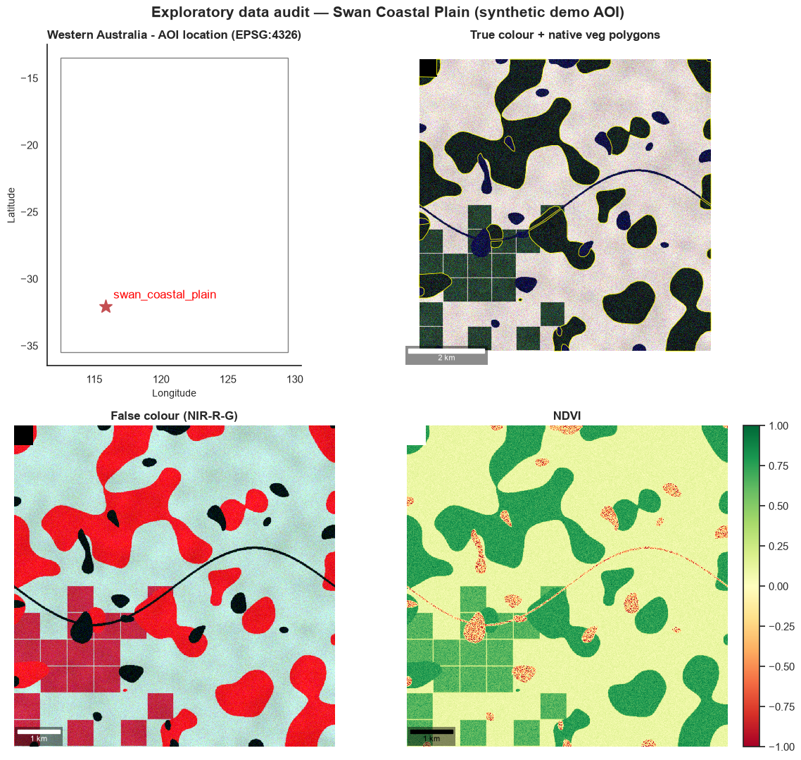
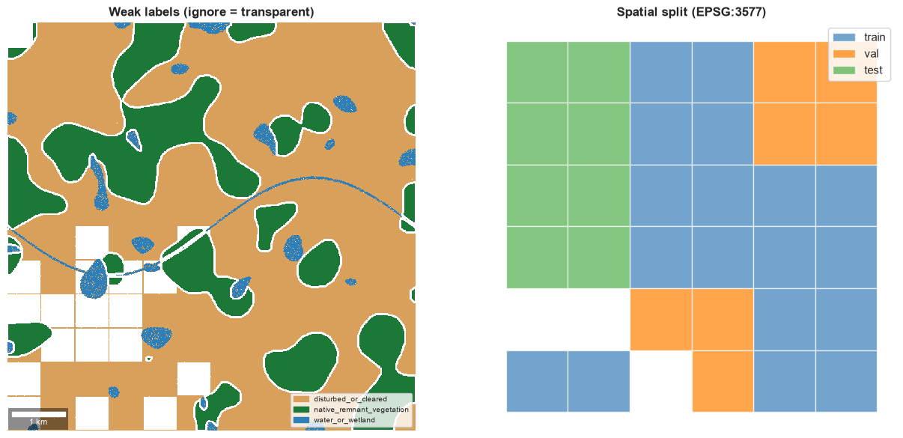
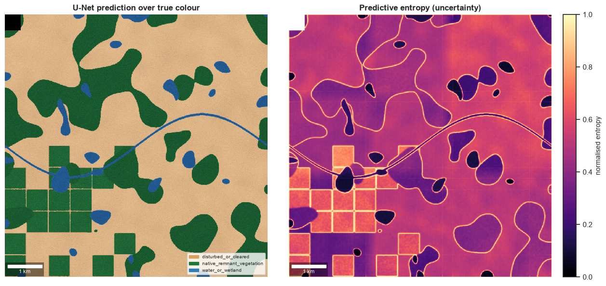
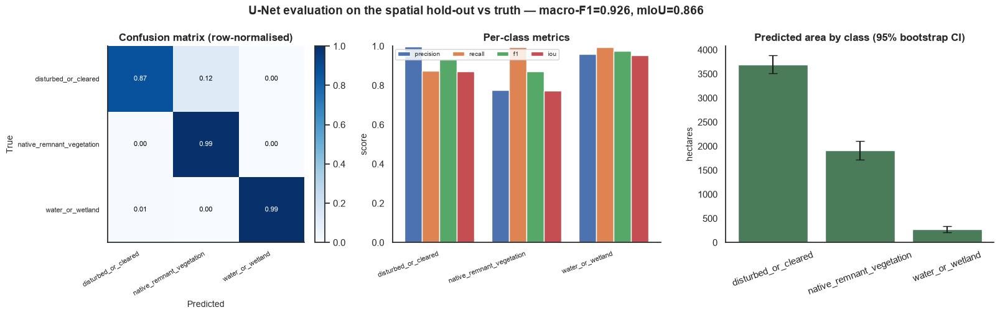
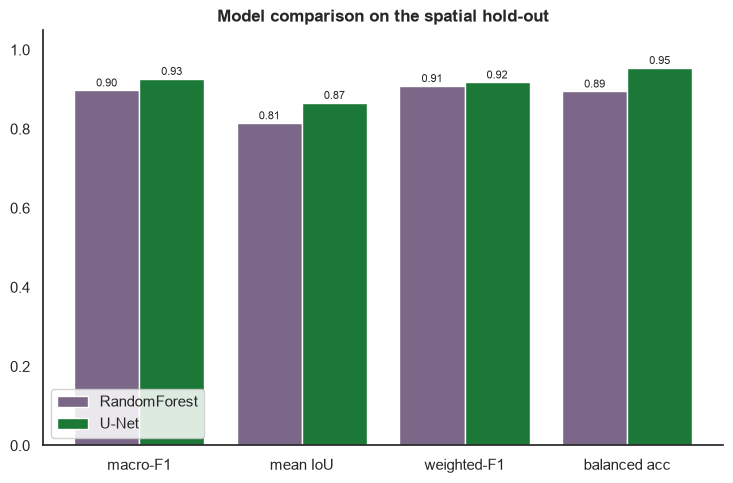
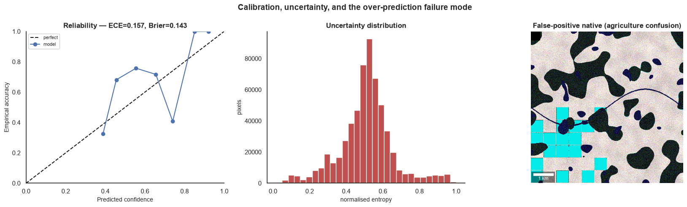

<div align="center">

# 🌿 WA EcoRehab AI

### Open-data geospatial AI for native-vegetation extent, disturbance, and rehabilitation-proxy monitoring in Western Australia

[](pyproject.toml)
[](https://github.com/Ahmad-Jaradat-Space/wa-ecorehab-ai/actions/workflows/ci.yml)
[](tests/)
[](pyproject.toml)
[](LICENSE)
[](#-quickstart)

[](src/ecorehab/models/unet.py)
[](src/ecorehab/utils/io.py)
[](docs/data_sources.md)
[](docs/spatial_validation.md)

**[Quickstart](#-quickstart)** · **[Visual tour](#️-visual-tour)** · **[Results](#-results)** · **[Flagship notebook](notebooks/WA_EcoRehab_AI_end_to_end.ipynb)** · **[Docs](#-documentation)** · **[Limitations](#️-limitations)**



</div>

---

WA EcoRehab AI turns **open Australian Earth-observation and government vector data** into repeatable, ML-driven vegetation maps, recovery indicators, and **uncertainty-aware hectare reports** for Western Australia. It is a portfolio-grade demonstration of the technical patterns behind real ecological-monitoring platforms: imagery ingestion → weak-label creation → segmentation → spatial validation → tiled batch inference → decision-grade area reporting.

> **🔍 Honesty first.** The bundled demo runs on a **synthetic-but-georeferenced** AOI — the *pixel values are fabricated*, but the CRS, affine transforms, nodata handling, polygons, tiling, and hectare maths are all **real**, and the same code paths consume real DEA/WA data (`aoi.demo: false`). This is a *production-style monitoring pipeline and open-data case study* — **not** species-level mapping, **not** a mine-rehabilitation compliance tool, and **not** validated against field data. The headline result below is an honest *failure* mode, reported up front.

## Why it matters

Mining, infrastructure, conservation, and environmental-consulting teams need **repeatable** monitoring of vegetation condition and rehabilitation progress over large areas. Manual photo-interpretation is slow, inconsistent, and hard to reproduce. The hard part is rarely the model — it is **honest labelling from imperfect open data, avoiding spatially-leaked validation, and attaching defensible uncertainty to every reported hectare.** This repo demonstrates that end-to-end engineering, and is candid about where the signal is weak.

## ✨ Highlights

- 🛰️ **Real geospatial engineering** — EPSG:3577 equal-area analysis, CRS-safe reprojection, rasterization, windowed reads, COG-friendly GeoTIFFs, polygonisation, hectare maths.
- 🏷️ **Weak-supervision with judgement** — labels from government vegetation polygons + transparent spectral gates, inward/edge buffers, an **ignore mask** for ambiguous pixels, and a per-pixel confidence raster.
- 🧠 **Two model families** — a scikit-learn **RandomForest** pixel baseline and a from-scratch **PyTorch U-Net** (GroupNorm, CE+Dice, class weights); optional SegFormer / XGBoost.
- 🗺️ **Spatial validation, not vanity metrics** — spatial-block train/val/test split, per-class precision/recall/F1/IoU, confusion matrices — never overall accuracy alone.
- 📊 **Calibrated uncertainty** — reliability curves, ECE/Brier, predictive-entropy rasters, and **block-bootstrap confidence intervals** on every reported hectare.
- 🏭 **Production shape** — config-driven YAML pipeline, 7 CLIs + a unified `ecorehab` command, tiled batch inference, an HTML site report, Docker, Makefile, 53 tests, GitHub Actions.

## 🖼️ Visual tour

<table>
<tr>
<td width="50%"><br>
<sub><b>1 · Exploratory data audit.</b> AOI within WA, true-colour with native-vegetation polygons, false-colour (vegetation in red), and NDVI. Note the managed-green agricultural grid — a deliberate confuser.</sub></td>
<td width="50%"><br>
<sub><b>2 · Weak labels & spatial split.</b> Polygon + spectral-rule labels with an ignore mask, and the spatial-block train/val/test split that prevents leakage.</sub></td>
</tr>
<tr>
<td width="50%"><br>
<sub><b>3 · Prediction & uncertainty.</b> U-Net classes over true colour, and a predictive-entropy map — confident interiors are dark, class boundaries and the agriculture confuser glow bright for ecologist review.</sub></td>
<td width="50%"><br>
<sub><b>4 · Evaluation.</b> Row-normalised confusion matrix, per-class precision/recall/F1/IoU, and predicted area with 95% bootstrap confidence intervals.</sub></td>
</tr>
<tr>
<td width="50%"><br>
<sub><b>5 · Model comparison.</b> U-Net vs RandomForest on the spatial hold-out across macro-F1, mean IoU, weighted-F1, and balanced accuracy.</sub></td>
<td width="50%"><br>
<sub><b>6 · Calibration & failure mode.</b> Reliability curve (ECE/Brier), uncertainty distribution, and the false-positive-native map — pinpointing where agriculture is misread as native vegetation.</sub></td>
</tr>
</table>

> 📓 The **[flagship notebook](notebooks/WA_EcoRehab_AI_end_to_end.ipynb)** runs the whole story end-to-end with an academic narrative and every figure rendered inline.

## 📈 Results

Evaluated on the **spatial-block test split** against hidden truth (demo AOI). The U-Net wins on macro-F1, mean IoU, and balanced accuracy; RandomForest is a strong, fast baseline.

| Model | macro-F1 | mean IoU | weighted-F1 | balanced acc |
|---|:---:|:---:|:---:|:---:|
| RandomForest (sklearn, 300 trees) | 0.897 | 0.814 | 0.908 | 0.895 |
| **U-Net** (from-scratch, GroupNorm, 7.8 M params) | **0.926** | **0.866** | 0.917 | **0.954** |

Per-class F1 is strong across all three classes (≈0.87–0.98), **but native precision is only 0.78** — the headline weakness.

### Uncertainty-aware area reporting (hectares, EPSG:3577)

| Class | Predicted (ha) | 95% bootstrap CI | Truth (ha) | Covers truth? |
|---|:---:|:---:|:---:|:---:|
| disturbed_or_cleared | 3,718 | [3,530 – 3,901] | 4,285 | no (under) |
| **native_remnant_vegetation** | **1,910** | **[1,723 – 2,096]** | **1,344** | **no (over, +42%)** |
| water_or_wetland | 269 | [213 – 339] | 249 | yes |

> **🎯 Honest headline finding.** Native vegetation is **over-predicted — 1,910 ha vs 1,344 ha truth (+42%), and the confidence interval does not cover truth.** The cause is a confuser baked into the AOI: **managed-green agriculture is spectrally close to native vegetation at 10 m** and is misclassified as native (native precision 0.78). This is exactly the kind of operationally-relevant failure mode this project is designed to *surface and quantify*, not hide. See **[docs/limitations.md](docs/limitations.md)**.

## 🚀 Quickstart

```bash
# 1. Environment (Python ≥3.10)
python -m venv .venv && source .venv/bin/activate
pip install -e ".[dev]"          # core + tests; add ,dl for SegFormer, ,boost for XGBoost

# 2. Run the entire pipeline offline on the synthetic AOI (~2 min on CPU)
make pipeline                    # data → labels → tiles → RF → U-Net → inference → report
python scripts/make_example_figures.py   # regenerate the README figures

# 3. Inspect the outputs
open outputs/reports/site_report.html
```

Prefer explicit stages? Every stage is a CLI taking `--config`:

```bash
python -m ecorehab.data.make_demo            --config configs/aoi_swan_coastal_plain.yaml
python -m ecorehab.labels.build_labels       --config configs/aoi_swan_coastal_plain.yaml
python -m ecorehab.labels.build_tiles        --config configs/aoi_swan_coastal_plain.yaml
python -m ecorehab.training.train_classical  --config configs/random_forest.yaml
python -m ecorehab.training.train_segmentation --config configs/unet.yaml
python -m ecorehab.inference.batch_predict   --config configs/inference.yaml
python -m ecorehab.reporting.build_site_report --config configs/report.yaml
# …or the unified entry point: `ecorehab pipeline --config configs/aoi_swan_coastal_plain.yaml`
```

**Switching to real data:** set `aoi.demo: false`, install `pip install -e ".[rs,dl,boost]"`, and the same commands pull DEA Sentinel-2 ARD via STAC and WA Government vectors. See **[docs/data_sources.md](docs/data_sources.md)**.

## 🔬 How it works

```
Open data → Weak labels → Spatial-block tiling → RandomForest + U-Net
          → Spatial evaluation + calibration → Tiled inference → Hectares + CI + report
```

- **Equal-area everything.** All labels, tiling, and hectare reporting use **EPSG:3577** (GDA94 / Australian Albers): an equal-area, metre-based CRS where every 10 m pixel is exactly 0.01 ha. Area in degrees (EPSG:4326) is wrong; UTM distorts away from its meridian.
- **Weak labels, honestly.** Native = inside inward-eroded polygons **and** NDVI ≥ 0.45; water = NDWI > 0.10 outside polygons; disturbed = NDVI < 0.25 outside polygons; **everything else → ignore (255)**. A 20 m edge ring and nodata are ignored, never guessed. ([docs/label_strategy.md](docs/label_strategy.md))
- **Spatial validation.** Tiles are grouped into coarse **blocks** assigned wholesale to train/val/test, so neighbouring (near-duplicate) tiles never straddle the split — the leakage that makes random splits over-optimistic. ([docs/spatial_validation.md](docs/spatial_validation.md))
- **Calibrated probabilities by design.** The U-Net uses **GroupNorm**, not BatchNorm: with few small batches, BatchNorm's running statistics never converge and flatten the softmax, ruining calibration and the uncertainty map.

## 🧭 Tyton-style capabilities demonstrated

| Capability | Where in the repo |
|---|---|
| PyTorch semantic segmentation | [`models/unet.py`](src/ecorehab/models/unet.py) (U-Net + GroupNorm), [`models/segformer.py`](src/ecorehab/models/segformer.py) (optional smp) |
| Classical ML pixel baselines | [`models/classical.py`](src/ecorehab/models/classical.py), [`training/train_classical.py`](src/ecorehab/training/train_classical.py) |
| CRS-aware geospatial engineering | [`utils/crs.py`](src/ecorehab/utils/crs.py), [`utils/io.py`](src/ecorehab/utils/io.py) (EPSG:3577, hectares, metadata preserved) |
| Weak-label generation from polygons | [`labels/weak_labels.py`](src/ecorehab/labels/weak_labels.py), [`labels/rasterize.py`](src/ecorehab/labels/rasterize.py) |
| Spatial sampling & leakage control | [`labels/tiling.py`](src/ecorehab/labels/tiling.py), [`evaluation/spatial_cv.py`](src/ecorehab/evaluation/spatial_cv.py) |
| Calibration & uncertainty | [`evaluation/calibration.py`](src/ecorehab/evaluation/calibration.py), [`evaluation/uncertainty.py`](src/ecorehab/evaluation/uncertainty.py) |
| Bootstrap area confidence intervals | [`evaluation/area_estimation.py`](src/ecorehab/evaluation/area_estimation.py) |
| Tiled / windowed batch inference | [`inference/tile_inference.py`](src/ecorehab/inference/tile_inference.py), [`inference/stitch.py`](src/ecorehab/inference/stitch.py) |
| Polygonised vector + COG-friendly rasters | [`inference/polygonize.py`](src/ecorehab/inference/polygonize.py), [`utils/io.py`](src/ecorehab/utils/io.py) |
| Reproducible, config-driven MLOps | [`utils/config.py`](src/ecorehab/utils/config.py), `configs/*.yaml`, `Makefile`, `Dockerfile`, CI |

## 🛰️ Data sources

Demo mode needs **none** of these (it fabricates a georeferenced AOI). They are the real inputs when `aoi.demo: false`.

| Source | Use | Licence |
|---|---|---|
| [DEA Sentinel-2 ARD](https://knowledge.dea.ga.gov.au/notebooks/How_to_guides/Downloading_data_with_STAC/) (`ga_s2am_ard_3`) | 10 m multispectral imagery (via STAC) | CC BY 4.0 |
| [DEA Land Cover](https://www.ga.gov.au/scientific-topics/dea/dea-data-and-products/dea-land-cover) | weak-label masks, change context | CC BY 4.0 |
| [DEA Fractional Cover](https://knowledge.dea.ga.gov.au/notebooks/DEA_products/DEA_Fractional_Cover/) | green / non-green / bare recovery signal | CC BY 4.0 |
| [WA Native Vegetation Extent](https://catalogue.data.wa.gov.au/dataset/native-vegetation-extent) | native-vegetation label polygons | CC BY 4.0 |
| [WA Mining Tenements (DMIRS-003)](https://catalogue.data.wa.gov.au/dataset/mining-tenements-dmirs-003) | AOI + per-tenement area overlays | CC BY 4.0 |

## 🗂️ Repository structure

```text
wa-ecorehab-ai/
├── src/ecorehab/
│   ├── data/         # demo AOI generator + DEA STAC / WA vector acquisition (CLIs)
│   ├── features/     # spectral indices (NDVI, EVI, NDWI, MNDWI, NBR, BSI) + texture
│   ├── labels/       # weak labels, rasterize, tiling + spatial split, sampling (CLIs)
│   ├── models/       # U-Net (GroupNorm), SegFormer (opt), RandomForest/XGBoost, losses
│   ├── training/     # dataset, augmentations, train_classical / train_segmentation
│   ├── evaluation/   # metrics, calibration, uncertainty, spatial CV, area estimation
│   ├── inference/    # windowed tiled inference, stitching, polygonize, batch_predict
│   ├── reporting/    # figures, maps, HTML site report
│   └── utils/        # config (pydantic+YAML), crs (EPSG:3577), io, logging
├── configs/          # YAML configs with an `extends` mechanism (AOIs + models)
├── notebooks/        # WA_EcoRehab_AI_end_to_end.ipynb (flagship case study)
├── docs/             # data sources, label strategy, spatial validation, model card, …
├── tests/            # 53 pytest tests (CRS, rasterization, tiling, metrics, area, …)
├── outputs/examples/ # committed README figures
├── Dockerfile · Makefile · pyproject.toml · .github/workflows/ci.yml
```

## 📚 Documentation

| Doc | What's inside |
|---|---|
| [Flagship notebook](notebooks/WA_EcoRehab_AI_end_to_end.ipynb) | the full case study, rendered end-to-end |
| [data_sources.md](docs/data_sources.md) | every dataset, access method, licence, band mapping |
| [label_strategy.md](docs/label_strategy.md) | weak-supervision rules, buffers, the ignore mask |
| [spatial_validation.md](docs/spatial_validation.md) | why random splits leak; spatial-block design |
| [model_card.md](docs/model_card.md) | model details, intended/out-of-scope use, metrics |
| [limitations.md](docs/limitations.md) | failure modes, the over-prediction finding, caveats |
| [gcp_batch_inference_design.md](docs/gcp_batch_inference_design.md) | how this scales on GCP (Vertex AI / GKE) |
| [reproducibility.md](docs/reproducibility.md) | seeds, env, manifests, exact repro commands |
| [references.md](docs/references.md) | data + methods citations |

## ⚠️ Limitations

Synthetic demo imagery; weakly-supervised labels (not field truth); single small AOI and a single-date composite; bootstrap CIs capture sampling error but **not** total model error (hence the native CI missing truth). This pipeline does **not** perform species-level classification, mine-rehabilitation compliance, drone-level accuracy from Sentinel-2, or field-validated accuracy. Full detail in **[docs/limitations.md](docs/limitations.md)**.

## 🔭 Future work

Real multi-AOI DEA ingestion · seasonal composites + cloud masking · SegFormer/DeepLabV3+ and XGBoost benchmarks · independent site holdouts and a formal accuracy assessment (Olofsson et al.) · MLflow tracking · the GCP batch-inference deployment in [docs/gcp_batch_inference_design.md](docs/gcp_batch_inference_design.md).

## 📄 License & acknowledgements

Code is **MIT** licensed ([LICENSE](LICENSE)). The open datasets it is designed to consume carry their own licences (mostly CC BY 4.0) — see [docs/references.md](docs/references.md). Built with [Digital Earth Australia](https://www.dea.ga.gov.au/), [WA Government open data](https://catalogue.data.wa.gov.au/), PyTorch, rasterio, and geopandas.

<div align="center"><sub>A senior-level geospatial-ML portfolio project · Western Australia · EPSG:3577</sub></div>
